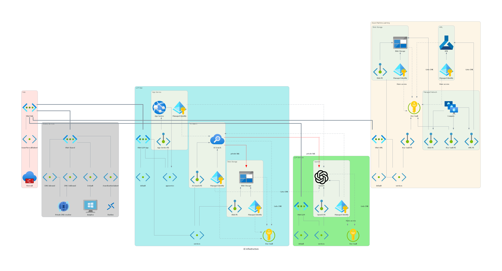

# Enterprise enabled infrastructure for Azure AI services


Note to fix current issue in WebApp:
```bash
az webapp config set --startup-file "python3 -m gunicorn app:app" --name llmapp-rzca --resource-group rg-eai-llmapp
```

When demonstrating AML managed VNET nothing will happen until you create first compute instance. Go to AML portal a create one and demonstrate pedning requests for Private Endpoint poping up in AML itself (control plane access), Key Vault and Storage.

